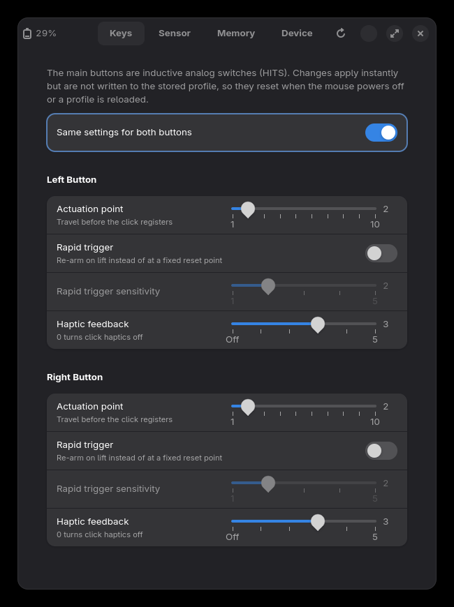
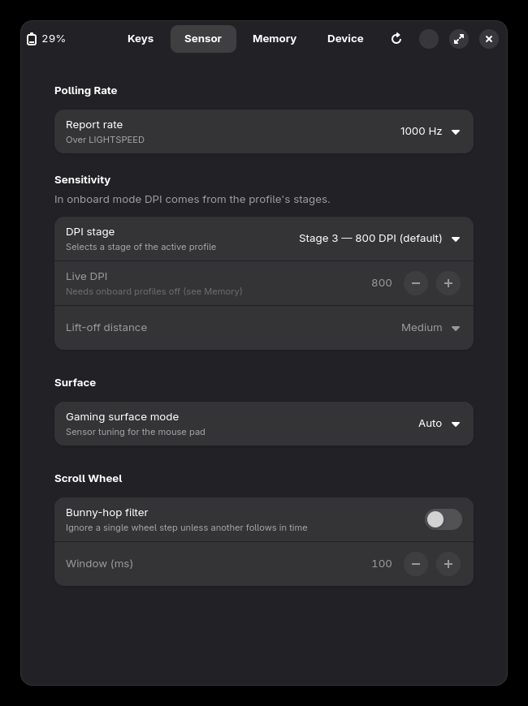
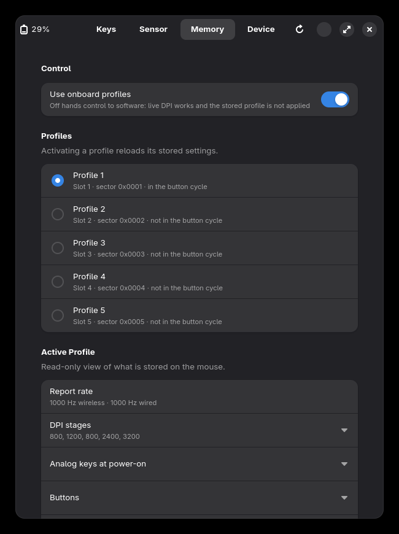
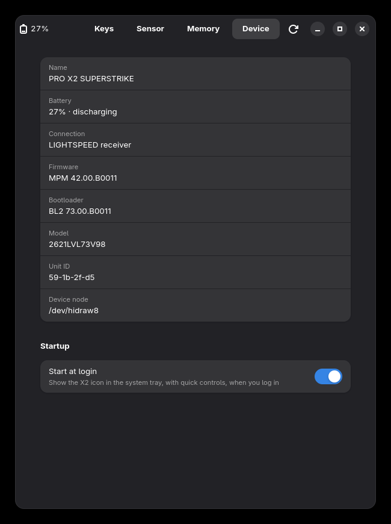
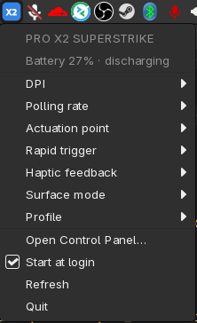

# Logitech G PRO X2 SUPERSTRIKE controller for Linux

This project is a userspace driver and a control panel for the Logitech G
PRO X2 SUPERSTRIKE gaming mouse. The mouse has hall-effect analog main
buttons (HITS). Logitech does not supply Linux software for this mouse.

The project has four parts:

- `libss2k` — a C11 driver library. It has no dependencies other than libc.
- `superstrikectl` — a command line tool.
- `superstrike-gui` — a GTK4/libadwaita control panel.
- `superstrike-tray` — a system tray icon with quick controls.

The driver supports these USB devices:

| Device | USB ID |
|---|---|
| Mouse, through the LIGHTSPEED receiver | `046d:40bd` |
| LIGHTSPEED receiver | `046d:c54d` |
| Mouse, with the USB cable | `046d:c0a8` |

The full wire protocol is in [`docs/PROTOCOL.md`](docs/PROTOCOL.md).

## Screenshots

| Keys | Sensor |
|---|---|
|  |  |

| Memory | Device |
|---|---|
|  |  |

| System tray |
|---|
|  |

## Functions

- **Analog keys (HITS):** Set the actuation point (1–10) for each main
  button. Set rapid trigger on or off, and set its sensitivity (1–5). Set
  the haptic feedback strength (0–5).
- **Polling rate:** Set 125 Hz to 8000 Hz. The cable supports a maximum
  of 1000 Hz. LIGHTSPEED supports a maximum of 8000 Hz.
- **DPI:** The sensor supports 100 to 44 000 DPI. In onboard mode, select
  one of the five DPI stages of the active profile. In host mode, set a
  live DPI value and the lift-off distance.
- **Onboard profiles:** Show the profile slots. Activate a profile. Change
  between onboard mode and host mode. Read a full profile sector and
  verify its CRC.
- **Other settings:** Gaming surface mode (auto, on, off) and the
  bunny-hop scroll filter.
- **Status:** Battery level, charge state, firmware versions and a raw
  HID++ monitor.

All settings apply immediately. The driver does not write settings to the
profile in flash memory. The mouse loads the stored profile again when it
starts or when you activate a profile. This resets the live settings.

## Requirements

- Linux with the `hid-logitech-dj` and `hid-logitech-hidpp` kernel drivers.
  The driver operates together with these kernel drivers.
- A C compiler and `make`.
- For the GUI: Python 3, `python-gobject`, `gtk4` and `libadwaita`.
- For the tray icon: `gtk3` and `libayatana-appindicator`, and a panel
  with a StatusNotifierItem tray. XFCE, KDE Plasma, Cinnamon and MATE
  have one. GNOME needs the AppIndicator extension.

On Arch Linux, install the GUI packages with this command:

```sh
sudo pacman -S python-gobject gtk4 libadwaita gtk3 libayatana-appindicator
```

## Installation

1. Compile the CLI and the library:

   ```sh
   make
   ```

2. Install the files and the udev rule:

   ```sh
   sudo make install
   ```

3. Load the udev rule:

   ```sh
   sudo udevadm control --reload
   sudo udevadm trigger
   ```

4. Disconnect the receiver, then connect it again.

The udev rule gives the user at the local seat access to the hidraw
devices of the mouse. Without the rule, the driver cannot open the mouse.

`make install` installs to `/usr/local` by default. To change this, set
`PREFIX`, for example `sudo make install PREFIX=/usr`. To remove the files,
use `sudo make uninstall`.

You can also start the programs from the source tree without installation:

```sh
./src/superstrikectl status
./gui/superstrike-gui
```

The GUI finds `libss2k.so` in `../src` or in `$PREFIX/lib`. To use a
different file, set the `SS2K_LIB` environment variable.

## Control panel

Start the control panel with `superstrike-gui`, or open
"SUPERSTRIKE Control Panel" from the application menu.

The control panel has four pages:

- **Keys** — Actuation point, rapid trigger and haptics for the left and
  right buttons. Set "Same settings for both buttons" to change the two
  buttons together.
- **Sensor** — Polling rate, DPI stage or live DPI, lift-off distance,
  gaming surface mode and the bunny-hop filter. The page shows only the
  polling rates that the current connection supports.
- **Memory** — Onboard or host mode, the profile list and a read-only view
  of the active profile.
- **Device** — Name, battery, connection, firmware, model and unit ID.

If the mouse does not answer, the control panel shows a message. Move the
mouse to wake it. The control panel tries again automatically.

## System tray and start at login

The tray icon shows "X2" on a coloured tile:

| Colour | Meaning |
|---|---|
| Blue | The mouse is connected. |
| Orange | The battery is at 15% or less and does not charge. |
| Grey | The tray cannot find the mouse, or the mouse does not answer. |

Click the icon to open the menu. The menu shows the battery level and
these quick controls:

- DPI (the five stages of the active profile)
- Polling rate
- Actuation point, rapid trigger and haptic feedback (both buttons)
- Surface mode
- Profile

The menu also has "Open Control Panel", "Start at login", "Refresh" and
"Quit".

To start the tray icon automatically when you log in, do one of these
steps:

- In the control panel, go to **Device** and set **Start at login** to on.
- In the tray menu, select **Start at login**.

The two controls use the same file:
`~/.config/autostart/superstrike-tray.desktop`. When you set **Start at
login** to on in the control panel, the tray icon also starts immediately.
To start the tray icon manually, use `superstrike-tray`.

The tray reads the mouse state again every 60 seconds and after each
change. The GUI, the tray and the CLI can operate at the same time.

## Command line

Commands that change the mouse need the `--yes` option.

```sh
superstrikectl status                    # show all device data
superstrikectl hits get                  # show the analog key settings
superstrikectl hits set --button 0 --act 7 --rt 3 --rt-on 1 --hap 5 --yes
superstrikectl rate set --rate 6 --yes   # 8000 Hz (LIGHTSPEED only)
superstrikectl dpi stage --stage 3 --yes # select stage 4 of the profile
superstrikectl mode host --yes           # give control to the software
superstrikectl dpi set --x 1600 --lod 1 --yes   # live DPI (host mode)
superstrikectl profile dir               # show slots and the active profile
superstrikectl profile info              # decode the active profile
superstrikectl profile activate 1 --yes
superstrikectl surface set on --yes
superstrikectl bhop set --wire 30 --yes  # 300 ms bunny-hop window
superstrikectl monitor --seconds 10      # show raw HID++ frames
```

Use `superstrikectl help` to see all commands and options.

## Safety

- The driver does not write profile sectors to flash memory. Each write
  erases flash, and an incorrect write can damage the button map.
- The driver does not use the Force Pairing feature (`0x1500`).
- The driver uses HID++ software IDs 2 to 15. Do not use ID 0 or ID 1.
  The kernel driver reads replies with ID 0 as device events, and it
  uses ID 1 for its own requests.
- The Python probes in `tools/` use software ID 0. They can cause an
  incorrect battery value in `/sys/class/power_supply/hidpp_battery_*`
  until the next real battery event.

## Project layout

```
src/ss2k.h, ss2k.c     driver library (protocol and device functions)
src/superstrikectl.c   command line tool
gui/                   control panel (GTK4), tray icon (GTK3), shared
                       Python binding (ss2k_binding.py), .desktop files
udev/                  udev rule for seat access
docs/PROTOCOL.md       reverse engineering notes and wire protocol
docs/screenshots/      control panel screenshots
tools/                 Python probes from the reverse engineering work
research/              notes, the live feature sweep and a profile dump
```

## Open work

These items are not complete. Refer to `docs/PROTOCOL.md` §8.

- The notification format of the button spy feature (`0x8110`). This
  feature can possibly stream analog key travel.
- The hidden feature groups `0x9403`, `0x18xx` and `0x1Exx`.
- The macro data format.
- Pairing without Logitech software.

## Credits

The protocol work uses the live device, and these public projects as
references: Solaar, libratbag, the Linux kernel `hid-logitech-hidpp`
driver, linux-superstrike, openGhub, mouse-protocol and superstrike-hits.

## License

GPL-2.0-or-later. Refer to [`LICENSE`](LICENSE).
